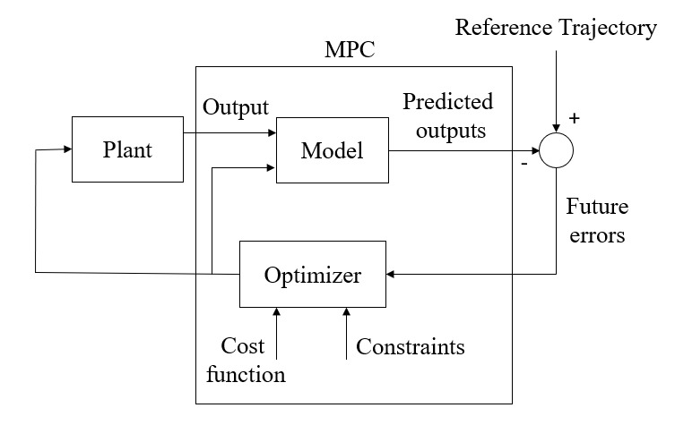
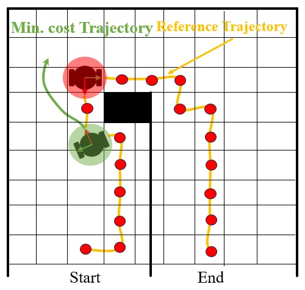
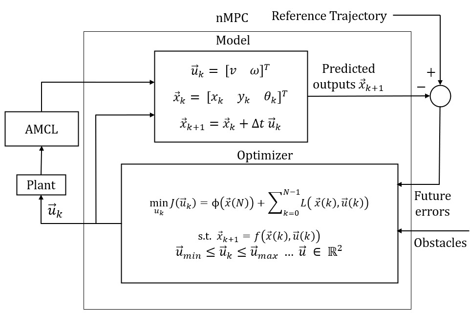
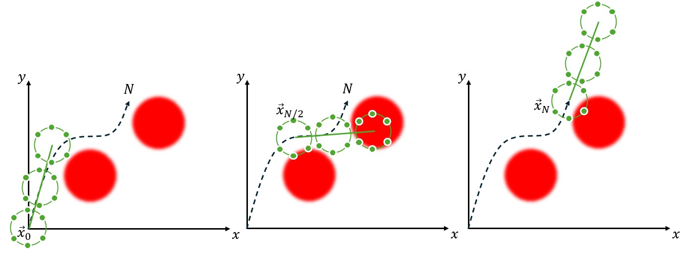
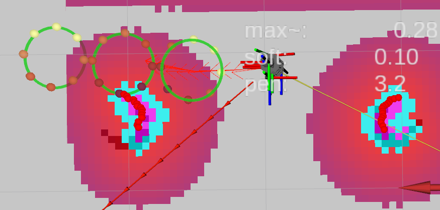
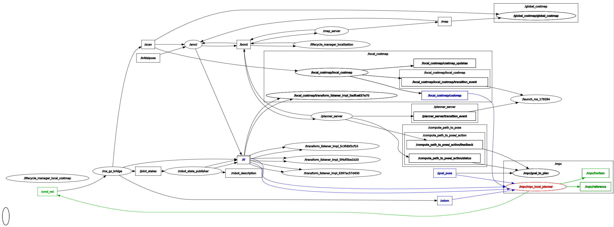

# Optimization Lab

## 1. Motivation:

This project demonstrates how optimization methods can be applied in
robotics.\
Applications include simultaneous localization and mapping (SLAM),
trajectory planning, and control using Model Predictive Control (MPC).

------------------------------------------------------------------------

## 2. Optimization Use Cases in Robotics:

Optimization frames three complementary questions: past (Localization), present (Control), and future (Planning).

### 2.1 Localization — Past
**Goal:** estimate where the robot has been and where it is now from noisy sensors.  

**Why optimization matters:**
- Principled fusion of heterogeneous data (IMU, odometry, LiDAR, vision)
- Drift reduction via loop-closures and robust outlier handling
- Uncertainty estimates (covariances) for downstream decisions

**Typical approach:**
- Filtering (EKF/UKF) and pose‑graph optimization (GraphSLAM, incremental solvers)

**Deliverables:**
- Consistent trajectory, map/landmarks, and associated uncertainties

### 2.2 Planning — Future
**Goal:** compute a safe, feasible, and efficient path or trajectory to a goal.  

**Why optimization matters:**
- Balances time, smoothness, energy, and clearance under constraints
- Enforces kinematic/dynamic limits and collision avoidance
- Produces time‑parameterized references for control

**Typical approach:**
- Search/sampling planners with smoothing (A*, RRT*, PRM + CHOMP/TrajOpt)
- Direct trajectory optimization with environmental costs and constraints

**Deliverables:**
- Executable, collision‑aware trajectory with timing

### 2.3 Control — Present
**Goal:** choose the best actions now to follow the plan and stay safe.  

**Why optimization matters:**
- Real‑time handling of input/state constraints and actuator limits
- Robustness to disturbances and model mismatch
- Tunable trade‑off between tracking accuracy and control effort

**Typical approach:**
- Model Predictive Control for constrained tracking; LQR for linear regimes; safety filters/shields

**Deliverables:**
- Feasible, bounded control commands with performance guarantees

**Outcome:** optimization provides a unified, principled way to combine objectives, constraints, and uncertainty for reliable robot behavior across past, present, and future.

------------------------------------------------------------------------

## 3. Theoretical Background
A controller selects inputs $u_k$ to drive the system state $x_k$ toward a desired reference while respecting model and constraints. Model Predictive Control (MPC) solves, at each step, a finite‑horizon optimization based on a system model, applies the first input, and repeats (receding horizon).

|     |     |
| --- | --- |
|  |  |

*Fig. 1: (Left) Simplified MPC block diagram (redrawn after Yakub & Mori, 2013 [1]). (Right) MPC objective—choose control inputs so the predicted trajectory tracks the reference while balancing effort and respecting constraints.*

### 3.1 Control Definition:


State and input (mathematical context)
- Discrete index: $k \in \mathbb{N}_0$ (sampling time $\Delta T$)
- State: $\;x_k \in \mathbb{R}^n$
- Control input: $u_k \in \mathbb{R}^m$

System dynamics
```math
x_{k+1} = f(x_k,\,u_k), \qquad f:\mathbb{R}^n \times \mathbb{R}^m \to \mathbb{R}^n
```

Special cases (common in this lab)
- Linear time-invariant (LTI): $\;x_{k+1}=A\,x_k + B\,u_k$
- Differential drive (example): $x_k=\begin{bmatrix}x & y & \theta\end{bmatrix}^\top,\; u_k=\begin{bmatrix}v & \omega\end{bmatrix}^\top$
- Ackermann (example): $x_k=\begin{bmatrix}x & y & \theta\end{bmatrix}^\top,\; u_k=\begin{bmatrix}v & \delta\end{bmatrix}^\top$

The objective of control is to choose $u_k$ so that $x_k$ tracks a given reference trajectory while satisfying constraints.

------------------------------------------------------------------------

### 3.2 Model
The model predicts the robot state over the prediction horizon (rollout). For a simple differential-drive mobile robot (DDMR, unicycle), a discrete-time kinematic model with sampling time $\Delta T$ is used:

```math
\begin{bmatrix}
x_{k+1}\\[2pt]
y_{k+1}\\[2pt]
\theta_{k+1}
\end{bmatrix}
=
\begin{bmatrix}
x_k\\[2pt]
y_k\\[2pt]
\theta_k
\end{bmatrix}
+
\Delta T\;
\begin{bmatrix}
\cos(\theta_k) & 0\\[2pt]
\sin(\theta_k) & 0\\[2pt]
0 & 1
\end{bmatrix}
\,
\underbrace{
\begin{bmatrix}
v_k\\[2pt]
\omega_k
\end{bmatrix}}_{u_k}
```

General notes
- **State:** $x_k=[x\;y\;\theta]^\top$ (world frame position and heading). Input: $u_k=[v\;\omega]^\top$ with forward speed $v$ (robot frame) and yaw rate $\omega$.
- **Assumptions:** planar motion, no slip, kinematic (no dynamics). Choose $\Delta T$ small enough for numerical stability (this is a forward-Euler discretization).

### 3.3 Cost Function

The cost function encodes “what good behavior means.” MPC chooses the control sequence that minimizes this cost over a finite prediction horizon. Minimizing cost is analogous to maximizing reward in reinforcement learning: low cost = high reward (and vice versa). You can therefore shape the robot’s behavior by adding terms (rewards/penalties) and tuning their weights.

Formal objective (quadratic tracking example)
```math
J = \sum_{k=0}^{N-1} \Big[(x_k - x_k^{ref})^T Q (x_k - x_k^{ref}) + u_k^T R u_k\Big] + (x_N - x_N^{ref})^T S (x_N - x_N^{ref})
```

Weight matrices, dimensions, and effect
- Dimensions: $x_k\in\mathbb{R}^n$, $u_k\in\mathbb{R}^m$.  
  $Q\in\mathbb{R}^{n\times n}$, $S\in\mathbb{R}^{n\times n}$, $R\in\mathbb{R}^{m\times m}$.
- Properties: $Q\succeq 0$, $S\succeq 0$ (symmetric positive semidefinite), $R\succ 0$ (symmetric positive definite) to ensure a well‑posed, convex quadratic cost in the linear case.
- Interpretation:
  - $Q$ weights state‑tracking error; larger entries penalize deviations more strongly.
  - $R$ penalizes control effort; larger entries yield smoother, slower inputs.
  - $S$ is a terminal weight to enforce end‑of‑horizon accuracy; often chosen $S\succeq Q$ (e.g., $S=Q$ or the LQR terminal matrix).
- Coupling: off‑diagonal elements couple states/inputs (e.g., jointly penalize $x$ and $y$ deviations). Diagonal matrices treat each component independently.
- RL analogy: low cost ≙ high reward. You can add terms (rewards/penalties) and tune weights to flexibly shape behavior.

How to shape behavior (reward–punishment analogy)
- Add negative cost (i.e., reward) for desirable states/actions and positive cost (punishment) for risky/undesirable ones.
- Examples you can add as extra terms:
  - Safety: penalty for proximity to obstacles or entering “no‑go” zones.
  - Smoothness: penalties on input changes (jerk/steering rate).
  - Progress: reward for reducing distance-to-goal or time-to-goal.
- Intuition: “Reward when the robot drives toward the cute cat” (negative cost near that target), “heavy penalty near the dangerous crocodile” (large cost in those regions). The optimizer will naturally prefer cat-ward, avoid crocodile-ward trajectories.

Why this is powerful
- One objective unifies multiple goals and constraints via weights.
- Small edits to terms or weights flexibly trade off speed, safety, energy, and smoothness without changing the controller architecture.

------------------------------------------------------------------------

### 3.4 Constraints

- Typical MPC bounds:
```math
  v_{\min}\le v_k\le v_{\max},\qquad
  \omega_{\min}\le \omega_k\le \omega_{\max}
```

Single vs. multiple shooting
- Single shooting: optimize inputs $\{u_k\}$ only; states come from integrating the model. State/path constraints are hard to enforce (often added as soft penalties).
- Multiple shooting: optimize both $\{x_k,u_k\}$; enforce dynamics as hard equality (“defect”) constraints
```math
    x_{k+1}-F(x_k,u_k)=0
```
  which makes it natural to impose hard state/path constraints at each node. This is why hard constraints are standard/necessary in multiple shooting.

Soft constraints (penalties/preferences)
- Implemented via cost terms; keep the NLP always feasible.
- Examples: obstacle proximity penalty, input rate/jerk penalties, soft speed preferences.

Hard constraints (must be satisfied)
- Input bounds, acceleration/steering‑rate limits:
```math
    v_{\min}\!\le\!v_k\!\le\!v_{\max},\quad
    \omega_{\min}\!\le\!\omega_k\!\le\!\omega_{\max},\quad
    |\Delta u_k|\!\le\!u_{\Delta,\max}
```
- State/path constraints: keep‑out half‑spaces, minimum distance, joint limits:
```math
  h(x_k,u_k)\le 0
```
- In multiple shooting, dynamics and these bounds enter as equality/inequality constraints and are enforced by the NLP solver (SQP/Interior‑Point). Use soft terms only for preferences or when strict feasibility cannot be guaranteed.

------------------------------------------------------------------------

### 3.5 Optimizer:

Why this matters here
- PyTorch provides fast automatic differentiation and a rich set of optimizers you can use beyond deep learning. MPC is one example: we optimize a sequence of controls with PyTorch just like we would optimize network weights.

Optimizers at a glance (by use case)
- **Learning (e.g., CNNs/RNNs):** stochastic gradient descent (SGD), Momentum, Nesterov, Adam, RMSProp.
- **Constrained nonlinear programs (trajectory optimization, MPC):** SQP/Interior‑Point (e.g., IPOPT), sequential convex programming; solve equality/inequality constraints natively.
- **Estimation (pose/factor graphs, bundle adjustment):** nonlinear least squares (Gauss‑Newton, Levenberg–Marquardt) in libraries like g2o, Ceres, GTSAM.
- **Derivative‑free/metaheuristics (global search/offline tuning):** Bayesian Optimization, CMA‑ES, PSO, evolutionary strategies; typically slower, useful for hyper‑parameters.

How PyTorch optimizers work (core ideas)
- Autograd: build a computation graph (cost from inputs); call `loss.backward()` to obtain exact gradients via reverse‑mode AD.
- Adam: adaptive SGD with first/second moment estimates (bias‑corrected). Good default for noisy or poorly scaled problems; step size controlled by `lr`.
- LBFGS (limited‑memory BFGS): quasi‑Newton method that approximates curvature from a short history of gradients; requires a closure to recompute loss/gradients; effective for smooth batch problems and small–medium parameter dimensions.

Minimal PyTorch patterns

- Adam (unconstrained or with soft penalties):
    ```python
    # ...existing code...
    import torch

    U = torch.zeros(N, m, requires_grad=True)   # decision variables (control sequence)
    opt = torch.optim.Adam([U], lr=1e-2)

    for it in range(max_iters):
        opt.zero_grad()
        x = x0.clone()
        cost = 0.0
        for k in range(N):
            x = f_discrete(x, U[k])            # differentiable rollout
            cost = cost + stage_cost(x, U[k])   # tracking, effort, obstacle penalties
        cost = cost + terminal_cost(x)
        cost.backward()
        opt.step()
        U.data = clamp_controls(U.data, u_min, u_max)  # optional projection
    ```

- LBFGS (needs closure)
    ```python
    # ...existing code...
    opt = torch.optim.LBFGS([U], lr=1.0, max_iter=20, line_search_fn="strong_wolfe")

    def closure():
        opt.zero_grad()
        x = x0.clone()
        cost = 0.0
        for k in range(N):
            x = f_discrete(x, U[k])
            cost = cost + stage_cost(x, U[k])
        cost = cost + terminal_cost(x)
        cost.backward()
        return cost

    opt.step(closure)
    ```

#### MPC with PyTorch: What Is Optimized

- **Decision variables:** the control sequence $U=\{u_0,\ldots,u_{N-1}\}$. Warm‑start by shifting the previous solution each cycle.
- **Rollout:** apply a differentiable model $f$ to predict states $x_1,\ldots,x_N$ from $x_0$ and $U$.
- Objective: quadratic tracking + control effort + optional soft terms (e.g., obstacle penalties, rate limits).
- **Constraints:**
  - **Soft:** add penalties or slack variables to the loss (keeps the problem always feasible; efficient with Adam/LBFGS).
  - **Hard:** project onto bounds (clamp) or use a constrained NLP solver (e.g., IPOPT/SQP) when strict feasibility is required, especially with multiple shooting.
- **Real‑time loop:** re‑solve each control step, apply the first input, shift the horizon (receding horizon). Limit iterations, warm‑start; GPU optional.


##### When to use classic NLP solvers (IPOPT/SQP)
- Needed for strict enforcement of hard state/path constraints, complementarity, or tight inequality bounds.
- Multiple shooting enforces dynamics at each node via equality constraints; constrained NLP solvers handle this robustly compared to unconstrained Adam/LBFGS.

------------------------------------------------------------------------

## 4. Model Predictive Control (MPC) Example:
In this example, MPC optimizes a sequence of controls using PyTorch tensors.

- **Block diagram:**


**Block Diagram Description**

The diagram illustrates the architecture of a nonlinear Model Predictive Control (nMPC) system for mobile robots. The main components and their interactions are as follows:

- **Reference Trajectory:** The desired path or sequence of states that the robot should follow is provided to the MPC system. In this example, the reference trajectory can be generated by a ROS2 Global Planner (such as Nav2), which computes a collision-free path from the robot's current position to the goal. The MPC controller uses this reference to optimize its control inputs and ensure accurate tracking.

- **Model:** The model predicts future robot states $\vec{x}_{k+1}$ based on the current state $\vec{x}_k$ and control input $\vec{u}_k = [v\;\omega]^T$ (linear and angular velocity). This prediction uses a discrete-time kinematic equation.

- **Optimizer (Inner Loop):** The optimizer solves a finite-horizon optimal control problem at each time step. It minimizes a cost function $J(\vec{u}_k)$, which typically includes tracking errors (difference between predicted and reference trajectory), control effort, and obstacle penalties. Constraints such as input saturation ($\vec{u}_{min} \leq \vec{u}_k \leq \vec{u}_{max}$) and obstacle avoidance are enforced. The optimizer uses the model to roll out predicted states and computes the cost for each candidate control sequence.

- **Plant (Outer Loop):** The plant represents the real robot or simulation. After optimization, only the first control input from the computed sequence is applied to the robot. The system then shifts the horizon and repeats the process at the next time step (receding horizon principle).

- **AMCL (Localization):** The robot's actual state is estimated using localization (e.g., AMCL), which feeds back into the MPC loop to correct for disturbances and model mismatch.

- **Saturation and Obstacles:** The optimizer ensures that control commands respect physical limits (saturation) and penalizes proximity to obstacles via the cost function.

### 4.1 States and Parameters (MPC with PyTorch)

- State vector (world frame):
```math
  x_k=\begin{bmatrix}x & y & \theta\end{bmatrix}^\top
```
- Control vector (body frame):
```math
  u_k=\begin{bmatrix}v & \omega\end{bmatrix}^\top
```
- Parameters:
  - Sampling time: $\Delta T$
  - Horizon length: $N$
  - Weights: $Q,S\in\mathbb{R}^{3\times 3}$, $R\in\mathbb{R}^{2\times 2}$ (symmetric; typically diagonal, with $Q,S\succeq 0$, $R\succ 0$)
  - Bounds:
```math
    v_{\min}\le v_k\le v_{\max},\quad \omega_{\min}\le \omega_k\le \omega_{\max}
```

Minimal PyTorch setup (decision variables and parameters):
```python
# ...existing code...
import torch

# Initial state x0 = [x, y, θ]
x0 = torch.tensor([x, y, yaw], dtype=dtype, device=device)

N = 20
# columns: [v, ω]
U = torch.zeros(N, 2, dtype=dtype, device=device, requires_grad=True)
```
------------------------------------------------------------------------

### 4.2 Kinematic Model (Differential Drive)

We use the unicycle/differential-drive model for prediction. Matrix and component forms:

```math
\begin{bmatrix}
x_{k+1}\\
y_{k+1}\\
\theta_{k+1}
\end{bmatrix}
=
\begin{bmatrix}
x_k\\
y_k\\
\theta_k
\end{bmatrix}
+
\Delta T\,
\begin{bmatrix}
\cos\theta_k & 0\\
\sin\theta_k & 0\\
0 & 1
\end{bmatrix}
\begin{bmatrix}
v_k\\
\omega_k
\end{bmatrix}.
```

```math
\begin{aligned}
x_{k+1} &= x_k + \Delta T\, v_k \cos\theta_k,\\
y_{k+1} &= y_k + \Delta T\, v_k \sin\theta_k,\\
\theta_{k+1} &= \theta_k + \Delta T\, \omega_k.
\end{aligned}
```

Assumptions: planar motion, no slip; forward‑Euler discretization with sampling time $\Delta T$.

```python
def kinematics_step(self, state: torch.Tensor, u: torch.Tensor) -> torch.Tensor:
    """Unicycle kinematics (discrete, forward Euler)."""
    x, y, th = state
    v, w = u
    T = self.c.T  # sampling time ΔT
    return torch.stack((
        x + T * v * torch.cos(th),
        y + T * v * torch.sin(th),
        th + T * w,
    ))
```

------------------------------------------------------------------------

### 4.3 Cost Function with Obstacle Penalty

The objective is augmented with an obstacle-avoidance penalty derived from the local costmap:

```math
J=\sum_{k=0}^{N-1}\Big[(x_k-x_k^{ref})^\top Q (x_k-x_k^{ref}) + u_k^\top R\,u_k + P(x_k)\Big]
\;+\; (x_N-x_N^{ref})^\top S (x_N-x_N^{ref})
```

Define the penalty by sampling the costmap around the predicted pose. For a sample set $\mathcal{S}$ around the robot footprint:
```math
P(x)= w \left(\max_{s\in\mathcal{S}} \mathrm{Costmap}(s)\right)^{p}
```
with weight $w>0$ and smoothing exponent $p\ge 1$ (larger values push the robot farther from obstacles).

```python
for k in range(N):
    u = self.clamp_u(U_local[k])
    state = self.c.model.kinematics_step(state, u)

    # tracking error (position + wrapped yaw)
    lin_err = state[:2] - ref_traj[k][:2]
    yaw_err = self.wrap_angle(state[2] - ref_traj[k][2])
    diff = torch.stack([lin_err[0], lin_err[1], yaw_err])

    # (x_k - x_k^ref)^T Q (x_k - x_k^ref)  +  u_k^T R u_k  +  P(x_k)
    J = J + diff @ Q @ diff + u @ R @ u + self.obstacle_penalty(state)

# terminal cost (x_N - x_N^ref)^T S (x_N - x_N^ref)
lin_err_T = state[:2] - ref_traj[-1][:2]
yaw_err_T = self.wrap_angle(state[2] - ref_traj[-1][2])
diff_T = torch.stack([lin_err_T[0], lin_err_T[1], yaw_err_T])
J = J + diff_T @ S @ diff_T
```

Note: Using max gives clear avoidance behavior; if you prefer smoother gradients, replace the max with a soft approximation (e.g., log-sum-exp or softmax-weighted mean).

```python
def obstacle_penalty(self, state: torch.Tensor) -> torch.Tensor:
    """
    Look-ahead ring sampling around centerline points in front of the robot.
    Aggregated with smooth-max (fixed beta) + soft ramp above threshold.
    """
    cm = getattr(self.c.node, "costmap", None)
    if cm is None or not cm.ready:
        return torch.tensor(0.0, dtype=torch.float32)

    x, y, th = state[0], state[1], state[2]
    cos_th = torch.cos(th); sin_th = torch.sin(th)

    r = float(self.c.fp_r + self.c.safe_m)
    M = max(1, int(self.c.samples_per_circle))
    d_list = self.c.ahead_dists if len(self.c.ahead_dists) > 0 else [0.0]

    vals = []
    for d in d_list:
        cx = x + cos_th * float(d)
        cy = y + sin_th * float(d)
        if r <= 1e-6 or M == 1:
            vals.append(cm.sample(cx, cy))
        else:
            for j in range(M):
                phi = 2.0 * math.pi * j / M
                ox = r * math.cos(phi)
                oy = r * math.sin(phi)
                wx = cx + cos_th * ox - sin_th * oy
                wy = cy + sin_th * ox + cos_th * oy
                vals.append(cm.sample(wx, wy))

    V = torch.stack(vals) if len(vals) > 1 else vals[0].unsqueeze(0)

    # smooth max with fixed beta (no parameter)
    beta = 8.0
    m = torch.max(V)
    val = m + torch.log(torch.clamp(torch.exp((V - m) * beta).mean(), min=1e-9)) / beta
    val = torch.clamp(val, 0.0, 1.0)

    if self.c.costmap_unknown_lethal:
        val = torch.where(val >= 0.992, torch.tensor(1.0, dtype=torch.float32), val)

    # soft ramp above threshold
    t = float(self.c.costmap_thresh)
    soft = torch.clamp((val - t) / (1.0 - t + 1e-6), 0.0, 1.0)
    return (soft ** float(self.c.costmap_power)) * float(self.c.costmap_weight)

```

Sampling the costmap around the robot pose
- Build a set of sample points in front of the robot and around its footprint.
  - Look‑ahead centers (world frame) for distances $d \in \mathcal{D}$:
```math
c_d
=
\begin{bmatrix}
  x\\
  y
\end{bmatrix}
+
d
\begin{bmatrix}
  \cos\theta\\
  \sin\theta
\end{bmatrix}.
```

  
*Fig. 2: Example look‑ahead circles illustrating how the obstacle penalty contributes at $x_0$, $x_{N/2}$, and $x_N$.*

- Circle samples of radius $r$ around each center:
```math
o_j =
\begin{bmatrix}
r\cos\phi_j\\
r\sin\phi_j
\end{bmatrix},
\qquad
\phi_j=\tfrac{2\pi j}{M},\; j=0,\ldots,M-1,
```
rotated by
```math
R(\theta)=
\begin{bmatrix}
\cos\theta & -\sin\theta\\
\sin\theta &  \cos\theta
\end{bmatrix},
```
and translated:
```math
s_{d,j}=c_d + R(\theta)\,o_j.
```

  
*Fig. 3: Circle centers are given by $c_d$; samples on each circle (here $M=8$) are $s_{d,j}$. Each sample point receives a value in $[0,1]$ via bilinear interpolation (see Costmap class). Markers are colored by their value, where light yellow indicates low cost and dark red indicates high costmap values.*

- Query the costmap at each sample to obtain values in $[0,1]$:
```math
V=\left\{\,\mathrm{Costmap}\!\left(s_{d,j}\right)\right\}.
```

Smooth maximum of sampled costs
- Aggregate $V$ with a smooth maximum (log‑sum‑exp with temperature $\beta$):
```math
m=\max_i V_i,
\qquad
\mathrm{val}
=
m
+
\frac{1}{\beta}\,
\log\!\left(\frac{1}{|V|}\sum_i \exp\!\big(\beta(V_i-m)\big)\right).
```
  As $\beta\!\to\!\infty$ this approaches $\max_i V_i$; smaller $\beta$ yields a smoother average. The gradient w.r.t. each sample is the softmax weight
```math
\frac{\partial\,\mathrm{val}}{\partial V_i}
=
\alpha_i
=
\frac{\exp\!\big(\beta(V_i-m)\big)}{\sum_j \exp\!\big(\beta(V_j-m)\big)}.
```

Thresholding and shaping
- Clamp to $[0,1]$ and (optionally) treat unknown cells as lethal (sets $\mathrm{val}\approx 1$ with near‑zero gradient in that branch).
- Apply a soft ramp above a threshold $t\in[0,1)$:
```math
\mathrm{soft}
=
\mathrm{clip}\!\left(\frac{\mathrm{val}-t}{1-t},\,0,\,1\right).
```
Values below $t$ incur no obstacle cost; above $t$ the penalty grows from $0$ to $1$.
- Final obstacle penalty at state $x$:
```math
P(x)= w\,\mathrm{soft}^{\,p},\qquad w>0,\; p\ge 1.
```
  Larger $p$ sharpens avoidance; $w$ scales its relative importance.

Why this steers the robot away from obstacles
- As any sampled point approaches occupied cells, $V$ increases, the smooth max grows, crosses the threshold $t$, and $P(x)$ rises rapidly (especially with large $p$ and $w$). Gradients back‑propagate through:
  - the softmax weights $\alpha_i$ (pointing away from high‑cost samples),
  - the costmap interpolation (spatial gradient),
  - the kinematics over the horizon (chain rule to the controls).

Notes
- $Q,S\in\mathbb{R}^{3\times 3}$, $R\in\mathbb{R}^{2\times 2}$ (symmetric; typically diagonal; $Q,S\succeq 0$, $R\succ 0$).
- Per‑step complexity is $\mathcal{O}(|V|)=\mathcal{O}(|\mathcal{D}|\cdot M)$. Increasing look‑ahead rings or samples improves safety cues at higher compute cost.
- If you need smoother gradients than max/thresholding, lower $\beta$ or use a softer aggregator (e.g., a softmax‑weighted mean).
- For this lecture, understanding or using this obstacle‑avoidance costmap system is not mandatory. It serves as an example of how an MPC controller can be applied and what advantages it offers compared with other controllers (e.g., a PID controller).


------------------------------------------------------------------------

### 4.4 Constraints on Control Inputs:

The control inputs are constrained as:

```math
v_{\min} \le v_k \le v_{\max}, \qquad \omega_{\min} \le \omega_k \le \omega_{\max}
```

These bounds ensure that the generated commands remain within the
robot's physical capabilities.

```python
def clamp_u(self, u_vec: torch.Tensor) -> torch.Tensor:
    v = torch.clamp(u_vec[0], self.c.v_min, self.c.v_max)
    w = torch.clamp(u_vec[1], self.c.w_min, self.c.w_max)
    return torch.stack([v, w])
```
Note
- With unconstrained PyTorch optimizers (e.g., Adam/LBFGS), apply a projection (clamp) after each step.  
- For strict state/path constraints, use multiple shooting with a constrained NLP (SQP/Interior‑Point).

------------------------------------------------------------------------

### 4.5 Optimizer

We solve the unconstrained MPC subproblem with PyTorch’s Adam each control cycle. Key points:
- Warm start: shift last solution and reuse it.
- Time budget: stop early to meet real-time.
- Gradient clipping: stabilize updates.
- Optional projection: clamp inputs after each step.
- For strict hard constraints or multiple shooting, consider SQP/Interior‑Point (e.g., IPOPT).

```python
# ...existing code...
import time
import torch

# Adam with time budget and gradient clipping
optimizer  = torch.optim.Adam([self.U], lr=0.2)  # decision vars: self.U ∈ ℝ^{N×2}
max_iters  = int(getattr(self.c, "solver_iters", 8))       # hard cap on iterations
time_frac  = float(getattr(self.c, "solver_tfrac", 0.5))   # fraction of control period used for solving
time_budget = max(1e-3, time_frac * self.c.T)              # seconds

start = time.perf_counter()
for _ in range(max_iters):
    # 1) zero grads
    optimizer.zero_grad(set_to_none=True)

    # 2) forward: rollout model and compute cost
    J, _ = rollout_cost_and_traj(self.U)

    # 3) backward: dJ/dU via autograd
    J.backward()

    # 4) stabilize step
    torch.nn.utils.clip_grad_norm_([self.U], max_norm=1.0)

    # 5) optimizer update
    optimizer.step()

    # 6) stop if time budget exceeded
    if (time.perf_counter() - start) > time_budget:
        break
```

You can easily switch optimizers by swapping the constructor:

```python
optimizer = torch.optim.LBFGS([self.U], lr=1.0, max_iter=20, line_search_fn='strong_wolfe')  # quasi-Newton
optimizer = torch.optim.Adam([self.U], lr=0.1)                                               # adaptive SGD
optimizer = torch.optim.RMSprop([self.U], lr=0.01)                                           # RMSProp
```


------------------------------------------------------------------------

## 5. ROS2 Package: `mpc_local_planner`:

This video shows the `mpc_local_planner` in live action, navigating to goal poses in a straight line as reference trajectory.


### 5.1 Structure:
- `mpc_local_planner`: ROS 2 nodes implementing the MPC controller, configs, maps, RViz setup, tests.
- `mpc_local_costmap`: local costmap configuration and node wrappers.
- `launch/`: brings up Nav2 components (AMCL, map_server, planner server), the local costmap, and the MPC node.
- `config/`: YAML configuration for Nav2, costmaps, and the controller.

Directory layout
``` bash
├── mpc_local_costmap
│   ├── config
│   ├── include
│   ├── launch
│   └── src
└── mpc_local_planner
    ├── config
    ├── launch
    ├── map
    ├── mpc_local_planner
    ├── resource
    ├── rviz
    └── test
```

------------------------------------------------------------------------

### 5.2 Node Graph:

High‑level data flow between Nav2 and the MPC local planner.


Topics (direction = publisher → subscriber)
- **/odom → mpc_local_planner**  
  - Robot odometry (state estimate) used for MPC rollout.
- **/goal_pose → mpc_local_planner**  
  - Target pose (e.g., from RViz or planner server).
- **/local_costmap/costmap → mpc_local_planner** 
  - Local occupancy/cost grid for obstacle penalties.
- **mpc_local_planner → /cmd_vel**
  - Velocity commands (Twist) sent to the robot base.

Notes
- The figure also shows internal MPC debug topics (e.g., /mpc/reference, /mpc/horizon) published for visualization.

------------------------------------------------------------------------

### 5.3 Launch Command:

Run from the workspace root:

```bash
colcon build --symlink-install
source install/setup.bash
ros2 launch mpc_local_planner mpc_local_planner.launch.py
```

This launch starts:
- TurtleBot3 Burger in simulation
- Nav2 stack (AMCL, map_server, planner_server, global/local costmaps)
- MPC controller node (`mpc_local_planner`)
- Goal‑pose to global‑plan helper node

Tip: open a new terminal and source the overlay before launching.

### 5.4 MPC Parameters:

Below is the parameter block used by the ROS 2 node. Vectors $Q$, $R$, $S$ are interpreted as diagonal weights (diag(Q), diag(R), diag(S)). Units are noted where relevant.

```yaml
mpc:
  mpc_local_planner:
    ros__parameters:
      # Controller parameters: MPC horizon, cost weights, and limits
      controller:
        # N: prediction horizon length (number of discrete steps)
        N: 12
        # Q: state tracking weight vector [x_weight, y_weight, theta_weight]
        Q: [10.0, 10.0, 0.25]
        # R: control input weight vector [v_weight, omega_weight]
        R: [0.2, 0.05]
        # S: terminal state weight vector (applied to final state)
        S: [2.0, 2.0, 0.5]
        # T: discretization timestep [s] used by the kinematics and planner
        T: 0.2
        # omega_max / omega_min: angular velocity limits [rad/s]
        omega_max: 0.7853981633974483
        omega_min: -0.7853981633974483
        # v_max / v_min: linear velocity limits [m/s]
        v_max: 0.4
        v_min: -0.1

      # Costmap / obstacle penalty parameters
      costmap:
        # ahead_distances: distances ahead of the robot to sample obstacle cost [m]
        ahead_distances: [0.0, 0.2, 0.4]
        # power: exponent applied to the soft obstacle penalty
        power: 2.0
        # samples_per_circle: number of sample points around the robot footprint
        samples_per_circle: 8
        # thresh: soft threshold (0..1) where obstacle penalty starts to ramp up
        thresh: 0.2
        # topic: ROS topic where the occupancy grid / local costmap is published
        topic: "/local_costmap/costmap"
        # unknown_is_lethal: treat unknown map cells as obstacles when true
        unknown_is_lethal: true
        # weight: multiplier for the obstacle penalty in the total cost
        weight: 300.0

      # Goal / stopping behavior parameters
      goal:
        # slow_exp: exponent shaping how max speed scales when approaching goal
        slow_exp: 1.0
        # slow_radius: radius [m] within which the robot starts to slow down
        slow_radius: 1.0
        # stop_pos_tol: position tolerance [m] to consider the goal reached
        stop_pos_tol: 0.12
        # stop_yaw_deg: yaw tolerance [degrees] to consider the goal reached
        stop_yaw_deg: 15.0
        # terminal_boost: multiplier to increase terminal cost near the goal
        terminal_boost: 5.0

      # Obstacle sampling / footprint parameters
      obstacle:
        # safety_margin: additional margin [m] added to the robot footprint when sampling
        safety_margin: 0.05

      # Reference generation parameters
      reference:
        # lock_radius: within this radius the reference is locked to the goal pose
        lock_radius: 0.5

      # Robot frame and footprint settings
      robot:
        # base_frame: the robot's base frame id used for TF and commands
        base_frame: "base_link"
        # footprint_radius: nominal robot footprint radius [m]
        footprint_radius: 0.18
        # parent_frame: global/frame used for planning (typically 'map')
        parent_frame: "map"

      # Solver settings
      solver:
        # max_iters: maximum inner optimization iterations per control step
        max_iters: 8
        # time_frac: fraction of control period allowed for solver runtime
        time_frac: 0.5

      # start_type_description_service: enable ROS type description service if required
      start_type_description_service: true
      # use_sim_time: set to true to use simulation clock (/clock)
      use_sim_time: true
```

Tuning notes
- Increase $Q/S$ to track tighter; increase $R$ for smoother/slower inputs.
- $N$ and $\Delta T$ trade prediction length vs. compute time ($\text{horizon}\approx N\Delta T$).
- costmap.weight and power shape obstacle aversion.
- v/omega bounds and slow_radius/stop tolerances set approach behavior.
- Rule-of-thumb: choose $S\succeq Q$; start with $S=Q$

Tip: Namespaces and parameter files
- If your node runs under a namespace (e.g., `mpc`), the YAML must mirror that namespace at the top level.
Example YAML:
```yaml
mpc:
  mpc_local_planner:
    ros__parameters:
      # ...
```

## 6. Optimization Lab Task:
Select one task from 6.1–6.5 and deliver the following packages and artifacts:

- **Plan (10%):**
  - Block diagram of the system and list of required kinematic / mathematical models.
  - Short design notes describing model choices and assumptions.

- **Simulation Package (20%):**
  - Provide a ROS2-compatible simulation setup (launch files, models).
  - Include at least one working scenario that demonstrates the chosen model (e.g., Ackermann vehicle, 4‑DOF manipulator).

- **Optimization Package (50%):**
  - Modify `mpc_local_planner` or implement a new MPC-based planner/controller.
  - Include discretized model, cost function and constraints code used by the optimizer.
  - Provide launch files and parameter/config files required to run the controller in simulation.

- **Documentation and Presentation (20%):**
  - Short demo video showing the system in operation.
  - Plots: cost vs. time, tracking/error plots, control inputs.
  - One RViz screenshot illustrating the run.
  - A README with build & run instructions and a brief evaluation (performance, limitations).

### 6.1 Ackermann Steering:
- Goal: adapt the planner to an Ackermann (bicycle) model instead of differential drive.
- State / input / parameter:
  - State: $x = [x\; y\; \theta]^\top$
  - Input: $u = [v\; \delta]^\top$ (linear speed $v$, steering angle $\delta$)
  - Parameter: $L$ = wheelbase
- Continuous kinematics (bicycle model):
```math
\dot{x}=v\cos\theta,\quad
\dot{y}=v\sin\theta,\quad
\dot{\theta}=\frac{v}{L}\tan\delta
```
- Discrete (forward Euler):
```math
x_{k+1}=x_k+\Delta t\;f(x_k,u_k)
```
- Notes: enforce steering limits $\delta_{\min}\le\delta\le\delta_{\max}$ and steering-rate bounds.

### 6.2 4‑DOF Manipulator:
- Goal: use MPC as a numerical inverse-kinematics solver to track end‑effector targets.
- State / input:
  - State: $q\in\mathbb{R}^4$ (joint angles; optionally include $\dot q$)
  - FK: $p_{ee}=f_{FK}(q)$
- Objective: minimize end‑effector error over the horizon subject to joint limits and velocity bounds.

### 6.3 2D Drone:
- Goal: planar motion planning (e.g. $(x,y,\theta)$ or $(x,y,v_x,v_y)$).
- Model: simple double‑integrator or kinematic model with acceleration limits.
- Note: test in a lightweight 2D simulator (e.g. PyRoboSim).

### 6.4 Speed Profiling (DDMR‑MPC):
- Goal: compute time‑parameterized speed profiles along a given path under dynamic constraints.
- Input: path waypoints + speed limits; Output: time‑parameterized velocity profile.

### 6.5 Obstacle Path Prediction (DDMR‑MPC):
- Goal: include predicted obstacle trajectories in the MPC cost or constraints.
- Method: use simple constant‑velocity predictions or occupancy samples and penalize predicted collisions (soft or hard constraints).

### 6.6 Omnidirectional Wheel Model:
**Goal:** Extend the MPC planner to support an omnidirectional robot (e.g., holonomic base with mecanum or omni wheels).

**State / input / parameter:**
- State: $x = [x\;\; y\;\; \theta]^\top$
- Input: $u = [v_x\;\; v_y\;\; \omega]^\top$

**Notes:**
- The model allows the robot to move in any direction and rotate simultaneously.
- The cost function and obstacle penalty terms can be reused; only the kinematic model and input bounds need to be adapted.
- Useful for robots with holonomic drive bases in indoor navigation and manipulation tasks.

## Citations
[1] F. Yakub and Y. Mori, “Effects of roll dynamics for car stability control by Laguerre functions,” 2013 IEEE International Conference on Mechatronics and Automation (ICMA), pp. 330–335, 2013. doi: 10.1109/ICMA.2013.6617940
